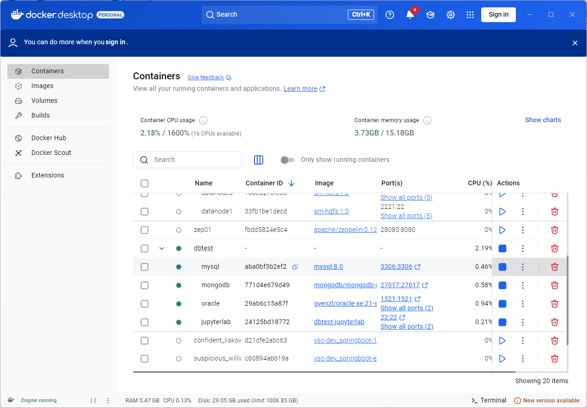

# 📊 빅데이터 분석 & DB 연동 실습 포트폴리오

> 다양한 공공데이터와 데이터베이스를 활용한 **분석·시각화·크롤링** 학습 프로젝트  
> **Docker** 기반으로 Oracle · MySQL · MongoDB 컨테이너를 띄우고 **JupyterLab**에서 실습합니다.

---

## 📑 목차

1. [개요](#개요)
2. [프로젝트 구조](#프로젝트-구조)
3. [주요 기술 스택](#주요-기술-스택)
4. [Docker 환경](#docker-환경)
5. [DB 연결 예시 코드](#db-연결-예시-코드)
6. [분석·시각화 예제](#분석시각화-예제)
7. [웹 크롤링 예제](#웹-크롤링-예제)
8. [학습 & 실무 활용 목적](#학습-실무-활용-목적)

---

## 개요

Python으로 **데이터 수집 → 저장(DB) → 분석 → 시각화** 전 과정을 경험하도록 설계했습니다.  
Docker 컨테이너로 데이터베이스를 격리해 실무에 가까운 환경을 재현하고, 결과물은 그래프·맵·워드클라우드 등 시각 자료로 정리했습니다.

---

## 프로젝트 구조

```
py*sm-main/
│
├── python/ 파이썬 기초문법
│ ├── DB/ # 다양한 DB 연동 실습 (Docker 기반)
│ │ ├── python12_CRUD_mongo.ipynb
│ │ ├── python12_CRUD_mysql.ipynb
│ │ └── python12_CRUD_oracle.ipynb
│ │
│ ├── 빅데이터 분석/ # 시각화 중심 분석 예제
│ │ ├── python11*교통사고 유형별 발생분석.ipynb
│ │ ├── python11*방범용 CCTV 위치분석.ipynb
│ │ └── python11*지하철이용현황분석.ipynb
```

---

## 주요 기술 스택

| Domain             | Stack                                                                                               |
| ------------------ | --------------------------------------------------------------------------------------------------- |
| **언어**           | Python 3.9+                                                                                         |
| **라이브러리**     | pandas · matplotlib · seaborn · wordcloud · selenium · cx_Oracle · mysql-connector-python · pymongo |
| **DB**             | Oracle XE 21c · MySQL 8.0 · MongoDB 6 (모두 Docker)                                                 |
| **개발/분석 환경** | Docker Desktop · JupyterLab                                                                         |

---

## 🐳 Docker 환경 구성

이 프로젝트에서 사용하는 Oracle, MySQL, MongoDB, JupyterLab 등의 컨테이너 설정은  
별도 GitHub 저장소에 정리되어 있습니다:

🔗 [👉 Docker 환경 구성 리포지터리 바로가기](https://github.com/sumin020415/Docker)

### 📸 실제 Docker 실행 예시 (Docker Desktop)



컨테이너 구성:

- **MySQL** (3306), **MongoDB** (27017), **Oracle** (1521), **JupyterLab** (22)

> 모든 실습은 위 컨테이너와 연결된 환경에서 실행됩니다.

---

## 📊 분석 예제 요약

### 1. 🚧 교통사고 유형별 발생 분석

- **파일**: `python/빅데이터 분석/python11_교통사고 유형별 발생분석.ipynb`
- **내용**: 사고 유형별로 데이터 그룹핑하여 시각화
- **기술**: `pandas`, `matplotlib`

---

### 2. 🛡 방범용 CCTV 위치 최적화

- **파일**: `python/빅데이터 분석/python11_방범용 CCTV 위치분석.ipynb`
- **내용**: 지역별 CCTV 분포와 사건 데이터를 비교하여 최적 위치 분석
- **기술**: `pandas`, `matplotlib`, 공간 정보 시각화

---

### 3. 🚇 지하철 이용 현황 분석

- **파일**: `python/빅데이터 분석/python11_지하철이용현황분석.ipynb`
- **내용**: 시간대별 승하차 분석을 통한 피크타임 도출
- **기술**: `pandas`, `seaborn`

---

### 4. 🛒 쇼핑몰 시각화

- **파일**: `python/빅데이터 분석/python11_쇼핑몰 시각화.ipynb`
- **내용**: 제품군/가격대별 상품 분포 및 시각화
- **기술**: `pandas`, `matplotlib`, `seaborn`

---

### 5. 👤 연령별 취업자 분석

- **파일**: `python/빅데이터 분석/python11_연령별취업자.ipynb`
- **내용**: 나이대별 고용 현황 추이 분석
- **기술**: `pandas`, `matplotlib`

---

### 6. 🌍 공간 정보 분석

- **파일**: `python/빅데이터 분석/python11_공간정보.ipynb`
- **내용**: 지역 좌표 기반 시각화 및 통계 요약
- **기술**: `folium`, `geopandas` 등

---

### 7. 🌐 청소년 정신건강 분석

- **파일**: `python/빅데이터 분석/python11__청소년정신건강분석.ipynb`
- **내용**: 청소년 정신건강 데이터에 대한 전처리 및 시각화
- **기술**: `pandas`, `matplotlib`, `seaborn`

---

### 8. ☁ 워드클라우드 생성

- **파일**: `python/빅데이터 분석/python11_wordcloud.ipynb`
- **내용**: 키워드 기반 시각적 분석
- **기술**: `wordcloud`, `matplotlib`

---

### 9. ✈ 인천공항 이용자 수 추이

- **파일**: `python/빅데이터 분석/python11_인천공항이용자수.ipynb`
- **내용**: 연도별 공항 이용객 수 추이 시각화
- **기술**: `pandas`, `matplotlib`

---

### 10. 💰 팁 문화 분석 (Seaborn 예제)

- **파일**: `python/빅데이터 분석/python11_팁문화분석(seaborn).ipynb`
- **내용**: 식사 팁 관련 통계 시각화
- **기술**: `seaborn`, `matplotlib`

---

## 📥 웹 크롤링 예제

### 11. 🔍 셀레니움 크롤링 시리즈

- **파일**:
  - `python/빅데이터 분석/python13_셀레니움크롤링.ipynb`
  - `python/빅데이터 분석/python13_셀레니움크롤링2.ipynb`
  - `python/빅데이터 분석/python13_셀레니움크롤링3.ipynb`
- **내용**:
  - 쇼핑몰 상품정보 크롤링
  - 환율/뉴스 등 실시간 크롤링
  - 수집된 데이터 pandas로 정제 후 저장
- **기술**: `selenium`, `beautifulsoup4`, `pandas`

---

## 📚 학습 및 실무 활용 목적

- 실무 수준의 **데이터 분석 역량 강화**
- 다양한 RDB 및 NoSQL에 대한 **DB 연동 실습**
- **공공데이터 활용** 및 실전 문제 해결 경험
- 포트폴리오 제출을 위한 **프로젝트 구성 및 정리 능력 향상**
